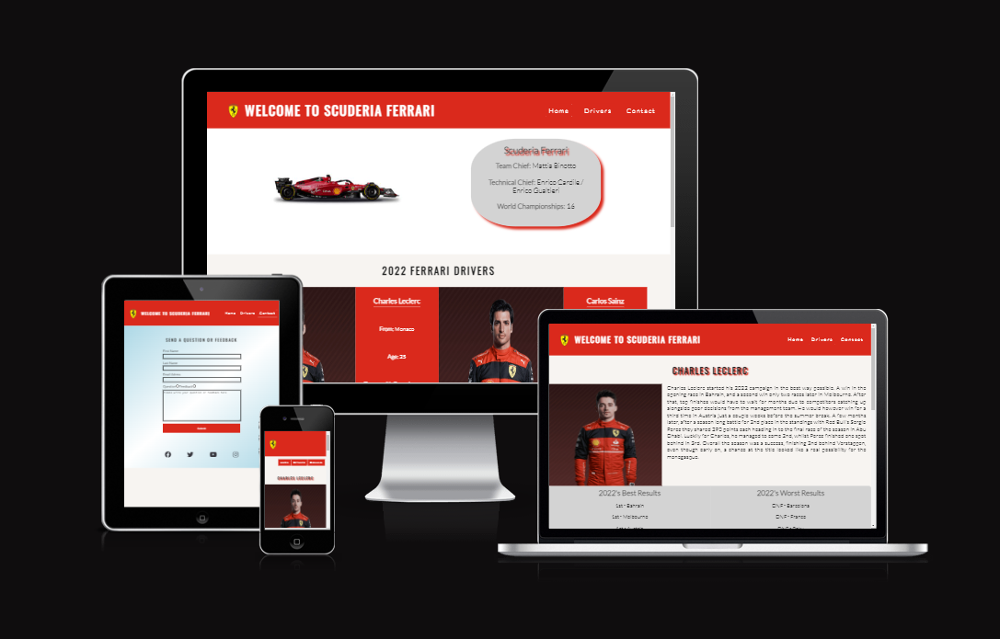
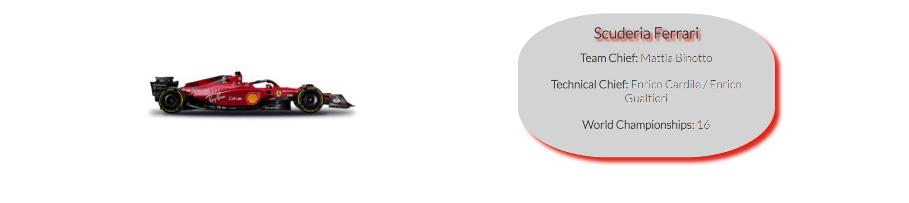
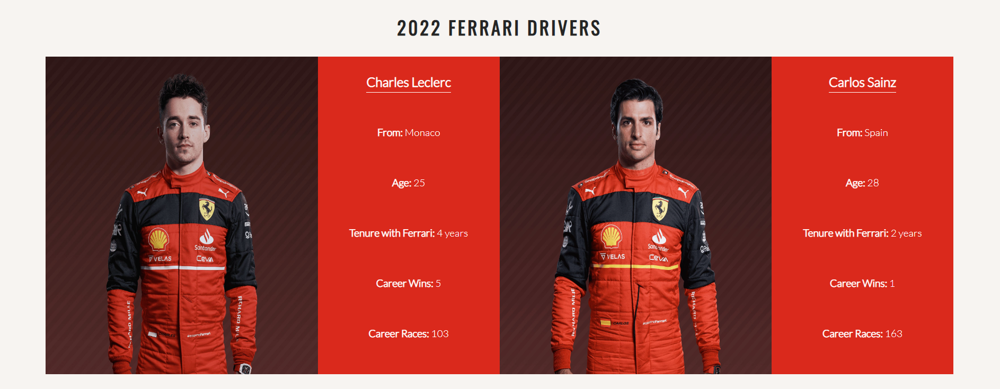
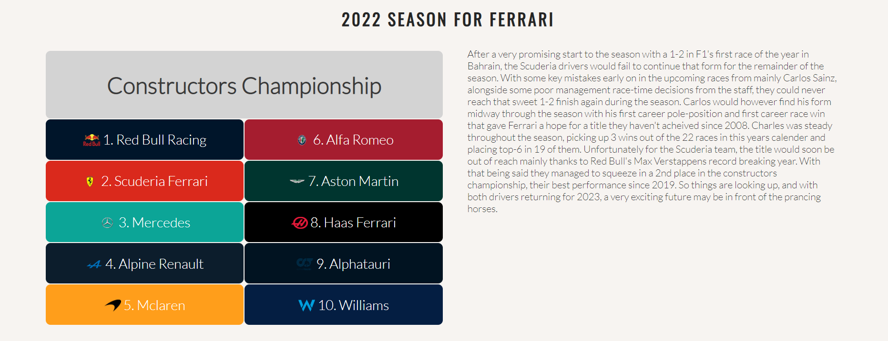
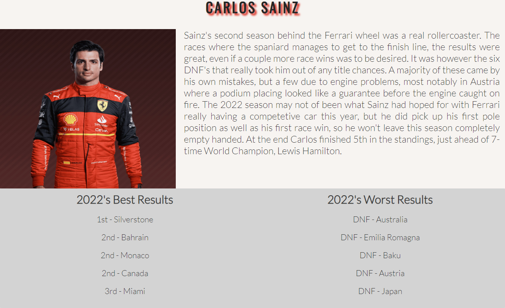
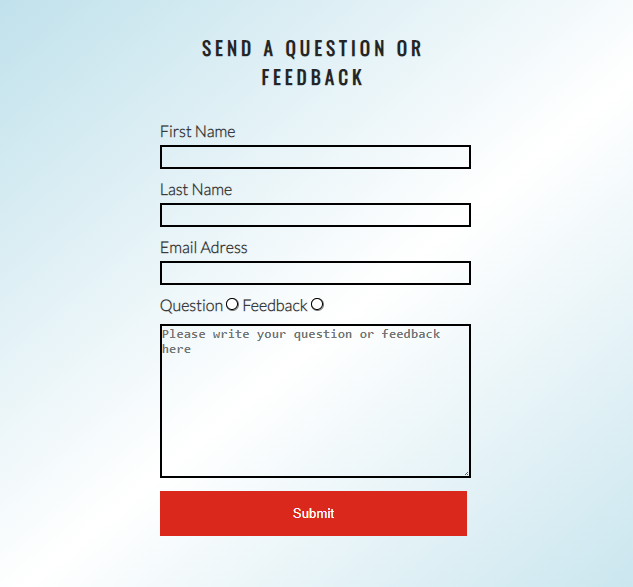
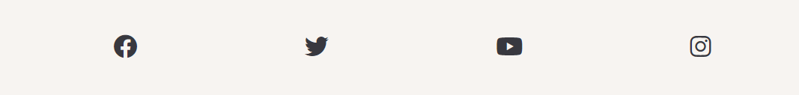
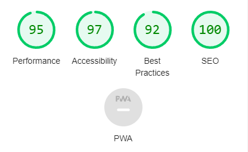
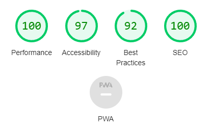
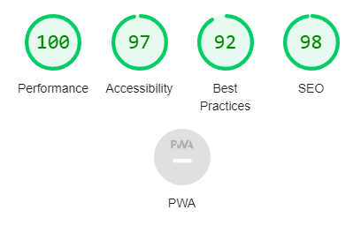

# Ferrari's 2022 F1 Season

This website is meant to display and recap the results and success that Ferrari's Formula 1 team had during the 2022 season. The website is targeted towards F1 fans in general and is a way to view the results for the Ferrari team all in the same place. 

Users of this website will be able to navigate to both the results of how all the teams did during the season along with a short recap discussing the results. Users can also navigate to a driver's page where both the Ferrari drivers individual results will be shown and discussed.

# Features

* Navigation

    * At the top of the page there is a navigation menu that takes you to the three different pages that the website contains. 
    * First you have the welcome text and Ferrari logo that takes you to the home page. There is also a link in the menu "Home" that takes you to the home page.
    * Then you have a "Drivers" link that will take you to the drivers page, where you can read more about the individual performances for the drivers.
    * Lastly, you have the "Contact" link that will take you to a page where you can submit a question or leave any feedback you might have. 
    

* Hero image and team info

    * The first section on the home page shows a hero image and some short information about the organization and history behind the team. 
    * This section lets users who aren't as familiar with Ferrari or even Formula 1 get a short introduction to the context of the website.
    

* Drivers section

    * After the team info on the home page, the user will be able to scroll down to a drivers section that shows some background information and career results for both of this year's drivers.
    * This lets the user familiarize themselves with the two individuals who the website is mostly about.
    

* Constructors section

    * Next on the home page is the team results of the year, also called the constructors results. Here you can see how all the ten teams that competed this season placed in the final standings.
    * There is also a recap on how Ferrari did as a team and how this years results matched recent years and expectations.
    

* Detailed drivers results

    * On the second page of the website, using the navigation menu or by clicking either drivers name the user will navigate to a more detailed view and discussion on how each driver did this season.
    * There is also a section that displays the best and worst race results.
    

* Contact form

    * On the third page, accessed by the navigation menu, there is a contact form.
    * Here the user can submit a question or send feedback.

* Footer

    * At the bottom of every page, there is a footer section
    * The footer shows social media icon links to some of the most common social medias.

# Future implementations
* A gallery page
* Better aspect ratio on images but still keeping the same structure.
* A seperate form for questions where there are some default FAQ that sort out already asked questions
* A FAQ Section 

# User Experience (UX)

### New user goals:
* User is able to find information about the 2022 season's results.
* User can easily locate to the different webpages and information they contain.

### Returning user goals:
* User can learn more about individual drivers results.
* User is able to locate the social media footers to learn more about information not available on this website.
* User can submit a question or their feedback.

# Surface

### Colors

Main colors used un this project:
* background color: #f7f4f1; or linear-gradient(320deg, lightblue, white, lightblue)
* font color: black
* link color: #da291c

### Fonts
* As a main font I used Lato, with a backup of sans-serif.

### Images
* I used images from [F1's Official Website](https://www.formula1.com/), [Car Logos](https://www.carlogos.org/) and [Logos World](https://logos-world.net/). All in which are credited in the Credits section.

# Technologies used

### HTML5
* As a structure language.
### CSS
* As a style language.
### Font Awesome
* As an icon library for a social links.
### Google fonts
* As a font resource.
### GitHub
* As a software hosting platform to keep project in a remote location.
### Git
* As a version-control system tracking.
### Gitpod
* As a development hosting platform.

# Testing

* I used Chrome DevTools throughout the project to check that my CSS behaved as expected and also used it as a quicker way to change CSS before officially applying them. 

* I have tested that this page works on different browsers, Chrome, Firefox and Safari.

* I can confirm that the website is responsive and will look good on all standars screen sizes.

* I confirmed that all the links works as expected in the navigation menu as well as the footer social media links.

* I confirmed that all text, navigation, images etc. is easy to understand and easily readable.

* I confirmed that the form works as expected, except for the submit button, which I will mention in greater detail in the Unsolved bugs section.

# Bugs

### Solved bugs

* For a long time I had a bug where all the content of the page would be pushed right on smaller screen sizes. I could not understand why this happened until I found that I had quite large padding on my container elements. This caused the content to push outside the screen. 
    * To solve this, I simply removed the horizontal padding from the containers. 

# Validator Testing

* HTML
    * No errors were found on either of the three pages when passing through the official W3C validator.
* CSS
    * No errors were found when passing through the official (Jigsaw) validator.
* Accessibility
    * I confirmed that the colors and fonts chosen are easy to read and accessible by running it through lighthouse in devtools.

    ### Home page: 

    

    ### Drivers page:

    

    ### Contact page:

    

# Unsolved bugs

* When you click the submit button at the contact form page, a 405 Not Allowed message comes up. I would like to just have it refresh the page and say something along the lines of "Thank you for your submission".  

# Deployment

* This website was deployed to GitHub pages. The steps to deply are as follows:
    * In the GitHub repository, navigate top the Settings tab.
    * From the menu on the left, select "Pages".
    * From the source section drop-down menu, select the Main Branch.
    * Once the main branch has been selected, the page provided the link to the completed website.

The live link can be found here - [Ferrari's 2022 Season](https://zaccco.github.io/Project-1/index.html)

# Credits

* To complete this project I used Code Instítute student template: [Gitpod full template](https://github.com/Code-Institute-Org/gitpod-full-template).
* I used a specialized media queries module that can be found [here](https://gist.github.com/gokulkrishh/242e68d1ee94ad05f488) to help me know the dimensions for common screen sizes and therefore be able to correctly make the website responsive.
* A lot of this website's inspiration has come from the CI [Love Running](https://github.com/Code-Institute-Solutions/love-running-2.0-sourcecode/tree/main/08-responsive-elements/05-responsive-gallery) project.
* The footer section is also taking directly from the [Love Running](https://github.com/Code-Institute-Solutions/love-running-2.0-sourcecode/tree/main/08-responsive-elements/05-responsive-gallery) project. However, the styling is done a little bit differently on this website.
* A user by the name of [Yusril Maulidan Raji](https://stackoverflow.com/users/3097810/yusril-maulidan-raji) on Stack Overflow, provided a way to style the radio buttons in the contact form. The question and answer was found [here](https://stackoverflow.com/questions/4253920/how-do-i-change-the-color-of-radio-buttons).
* All the information about the Ferrari team and information about the drivers was found on [F1's Official Website](https://www.formula1.com/).
* The official color used as background color for every team in the constructors table was found on [F1's Official Website](https://www.formula1.com/).

# Media 

* The driver and team photos used throughout the website are taken from [F1's Official Website](https://www.formula1.com/).
* The transparet images for the car team-logos was either found on [Car Logos](https://www.carlogos.org/) or [Logos World](https://logos-world.net/).
